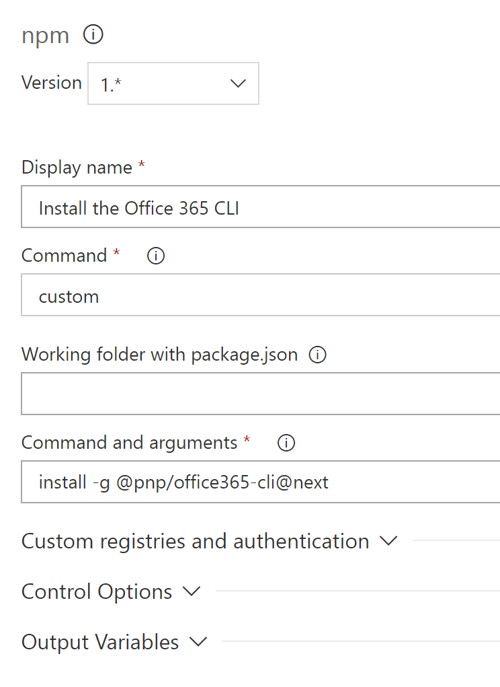

# SharePoint / Office 365 Saturday Madrid 2018

En este repositorio podrás encontrar los materiales utilizados en el Workshop **ALM para soluciones basadas en SharePoint Framework** impartido durante el SharePoint / Office 365 Saturday Madrid 2018.

## Ponentes
1. Adrián Díaz - MS Office Development MVP [@AdrianDiaz81](https://twitter.com/AdrianDiaz81)
2. Luis Máñez - MS Office Development MVP [@LuisManez](https://twitter.com/luismanez)

# ALM para soluciones basadas en SharePoint Framework

## Pre-requisitos

Para completar el workshop, previamente se debe configurar tanto la tenant de Office 365, como el entorno local. Para ello se recomienda seguir los siguientes artículos:

1. [Setup your Office 365 Tenant](https://docs.microsoft.com/en-us/sharepoint/dev/spfx/set-up-your-developer-tenant)
2. [Set up your SharePoint Framework development environment](https://docs.microsoft.com/en-us/sharepoint/dev/spfx/set-up-your-development-environment)
3. [Instalar los comandos para SharePoint Online de PowerShell](https://go.microsoft.com/fwlink/p/?LinkId=255251)
4. [Instalar PnP PowerShell Commands](https://github.com/SharePoint/PnP-PowerShell)

Para el propósito del Workshop, vamos a hacer Deploy de la solución spfx a nivel de Site Collection App Catalog. Existen dos opciones para el Deploy de nuestras soluciones spfx: 

1. Hacerlo a nivel de Tenant App Catalog. Esto nos permite poder instalar nuestra solución en cualquier site collection de nuestr Tenant.
2. Hacerlo a nivel de Site Collection App Catalog. De esta forma, nuestra solución sólo estará disponible a nivel de la site collection donde se ha desplegado. Puedes saber más en [Use the site collection app catalog](https://docs.microsoft.com/en-us/sharepoint/dev/general-development/site-collection-app-catalog)

Ambas opciones tienen sus ventajas e inconvenientes. En este caso lo haremos a nivel de Site Collection, que nos va a ofrecer un nivel de aislamiento mayor, donde por ejemplo, si tenemos varios desarrolladores trabajando sobre la misma Tenant de Office 365, cada uno va a poder desplegar su solucion de forma independiente, probando así varias versiones sin conflicto con otros desarrolladores.

Para poder utilizar el App Catalog a nivel de Site Collection, primero vamos a tener que configurarlo. Para ello podemos ejecutar lso siguientes comandos:

```ps
Connect-SPOService -Url TENANT-ADMIN-SITE-URL

Add-SPOSiteCollectionAppCatalog -Site URL-TO-TARGET-SITE-COLLECTION
```

Como último pre-requisito, vamos a necesitar configurar el CDN público de Office 365, ya que lo necesitaremos para hospedar los scripts de nuestra solución spfx. Para ello, asegúrate de ejecutar el comando:

```ps
Set-SPOTenantCdnEnabled -CdnType Public
```

**Nota**: Una vez ejecutado el comando anterior, llevará algo de tiempo hasta que realmente queda configurado, puedes ver el estado del CDN con el comando _Get-SPOTenantCdnOrigins -CdnType Public_


A la hora de hospedar nuestros scripts, tenemos varias opciones:
1. Podemos utilizar el CDN de Azure, incluso otros servicios CDN (Cloudflare, Amazon, etc)
2. Cualquier biblioteca de SharePoint. En este caso no te beneficias de las ventajas de un CDN
3. Puedes configurar cualquier biblioteca de SharePoint para que funcione con un CDN (puedes hacerlo con los mismos comandos de PS anteriores, pero apuntando a las bibliotecas de SP que quieras configurar como CDN)
4. Utilizar el CDN 'Automático' de Office 365. Similar al punto anterior, pero utilizando el CDN por defecto de Office 365 (*/CLIENTSIDEASSETS). Esto nos va a facilitar el Deploy de nuestra solución, ya que luego haremos uso de la property _includeClientSideAssets_ para desplegar nuestros scripts directamente al CDN por defecto.

## Spfx webpart

Para continuar con el workshop, tenemos que crear nuestra solución spfx. Para ello vamos a crear un proyecto webpart haciendo uso del generador de Yeoman para spfx.

Para agilizar el proceso, recomendamos que clones el repositorio en tu local 
// TODO

Si ejecutamos el webpart en el local workbench, veremos un simple webpart que muestra la versión 1.0.0 (luego cambiaremos esto para ver como versionar webparts y actualizar soluciones ya desplegadas)

## Deployment a SharePoint

Una vez tenemos nuestra solución spfx, ya podemos continuar con el proceso de Deploy a SharePoint. De nuevo, en este punto tenemos diferentes opciones:

1. ALM APIs: Por fin Microsoft ofrece unas APIs para facilitar procesos de ALM con soluciones SharePoint. Durante el workshop veremos con más detalle estas APIs. Puedes saber más en este link [Application Lifecycle Management (ALM) APIs](https://docs.microsoft.com/en-us/sharepoint/dev/apis/alm-api-for-spfx-add-ins)
2. [Comandos PnP PowerShell](https://docs.microsoft.com/en-us/sharepoint/dev/apis/alm-api-for-spfx-add-ins#sharepoint-pnp-powershell-cmdlets). Disponemos de varios comandos PowerShell de la gente del PnP para procesos ALM. Al final estos comandos son simples _wrappers_ de la ALM API
3. [node-sp-alm package](https://www.npmjs.com/package/node-sp-alm). Esto es un paquete npm con acciones para procesos de ALM. De nuevo, nos es más que otro _wrapper_ alrededor de la ALM API, en este caso basado en Node, por lo que podemos utilizarlo para extender la toolchain del spfx.
4. [Office 365 Cli commands](https://docs.microsoft.com/en-us/sharepoint/dev/apis/alm-api-for-spfx-add-ins#office-365-cli-commands-to-add-deploy-and-manage-sharepoint-apps-cross-platform). Un _wrapper_ más, en este caso un CLI cross-platform, por lo que podríamos usarlo desde Linux o Mac.
5. Proceso manual a través de la IU de SharePoint.

Como hemos dicho, veremos más adelante las ALM APis, así que en este punto vamos a ver como ayudarnos de los comandos PS del PnP para hacer la instalación.

Antes de nada, tenemos que preparar el paquete de la solución spfx, para ello tenemos que ejecutar los siguientes comandos de _gulp_

```js
gulp bundle --ship

gulp package-solution --ship
```

Esto nos va a generar un fichero _/sharepoint/solution/spfx-alm.sppkg_ que contendrá la definición de la App, así como los scripts (ficheros js) y assets incluídos en la solución.

__Nota__: Recuerda que estamos utilizando la opción del CDN Automático de SharePoint para hospedar los ficheros JS y assets de la solución. Con esta opción, los ficheros se incluyen en el propio .sppkg. Si utilizas otro CDN, entonces tienes que copiar los ficheros JS y assets generados en la carpeta _temp/deploy_ a tu CDN.

Ejecuta los siguientes comandos para Desplegar e Instalar la solucion spfx en SharePoint:

```ps
Connect-PnPOnline -Url [SITE_COLLECTION_URL]

$app = Add-PnPApp -Path "[FULL_PATH]\sharepoint\solution\spfx-alm.sppkg" -Scope Site -Publish -Overwrite -Publish

Install-PnPApp -Identity $app.Id -Scope Site
```
El proceso de instalación de la App es asíncrono, por lo que puede llevar varios minutos hasta que realmente esté disponible. Puedes comprobar el estado de la app desde el comando _Get-PnPApp_ en su propiedad _InstalledVersion_.

Una vez desplegada e instalada la solución, puedes editar cualquier página y añadir el webpart:


## Update Solution

Para probar el proceso de _update_, primero vamos a cambiar la versión de nuestra solución. Para ello:
1. Edita el fichero _package.json_ y actualiza la propiedad _version_ a "2.0.0"
2. Edita el fichero _config/package_solution_ y actualiza _version_ a "2.0.0.0" (fíjate que en este caso la versión contiene 4 números. Esto es porque SharePoint no utiliza _semver_ para el versionado. Se recomienda que utilices el mismo número que en el punto anterior, poniendo el último dígito a cero, para asi coincidir con la versión del _package.json_)
3. Edita el webpart para que pinte la versión actualizada:

```xml
<p className={ styles.subTitle }>Version: 2.0.0</p>
```

Una vez actualizadas las versiones en el código fuente, debemos volver a generar el paquete con los comandos de _gulp_ (podemos lanzar varios comandos a la vez utilizando _&&_)

```js
gulp bundle --ship && gulp package-solution --ship
```

Una vez generado el nuevo .sppkg, podemos actualizar la versión con los comandos del PnP. Primero desinstalamos la versión existente:

```ps
$app = Get-PnPApp -scope site | where { $_.Title -eq 'spfx-alm-client-side-solution' }

Uninstall-PnPApp -Identity $app.Id -Scope Site
```

La desinstalación de la App es un proceso asíncrono, por lo que puede llevar varios minutos hasta que realmente esté desinstalada. Puedes comprobar el estado de la app desde el comando _Get-PnPApp_ en su propiedad _InstalledVersion_.

Una vez desinstalada la App, podemos repetir el proceso de instalación para actualizar a la nueva versión. Si lo hacemos, y refrescamos la página con el webpart, veremos como aparece la nueva

### Extendiendo la toolchain con procesos ALM

Como complemento, en el fichero _./pipeline/sp-deploy.js_ se ha creado una tarea _gulp_ que despliega e instala la solución utilizando el paquete de npm _node-sp-alm package_

__Nota__: La tarea no está completa, y queda como posible futuro ejercicio el completarla para que soporte la actualización del paquete.

```js
return gulp.src(fileLocation).pipe(through.obj((file, enc, cb) => {

        spAlm.add(fileName, file.contents, true, false).then(data => {
          build.log('Solution package added');
          const packageId = data.UniqueId;

          spAlm.deploy(packageId, skipFeatureDeployment, false).then(data => {
            build.log('Solution package deployed');

            build.log('Upgrade action: ' + environmentInfo.upgrade)
            if (!environmentInfo.upgrade) {
              spAlm.install(packageId).then(data => {
                build.log('Solution installed');
                cb(null, file);
              });
            } else {
              spAlm.upgrade(packageId).then(data => {
                build.log('Solution upgraded');
                cb(null, file);
              });
            }
          });
        });
      })).on('finish', resolve);
```

## API ALM
 Por fin Microsoft ofrece unas APIs para facilitar procesos de ALM con soluciones SharePoint y todo el desarrollo moderno se puede llevar a cabo sin tener que hacer ningun workarround "tenebroso". En primer lugar vamos a ver que podemos hacer con esta API:
 -Añadir/Quitar una solución de Spfx (Webpart o Extensión) al catálogo de aplicaciones.
 - Habilitar/Deshabilitar una solución de Spfx (Webpart o Extensión) para que estén disponibles para su instalación en el catálogo de aplicaciones de la colección de sitios o el espacio empresarial.
 - Instalar/Actualizar/Desinstalar en un sitio una solución dsolución de Spfx (Webpart o Extensión)
- Listar todos y obtener los detalles de las soluciones Spfx

## Métodos de la API

1. Añadir un paquete de solución al catálogo de aplicaciones
```js
url: /_api/web/tenantappcatalog/Add(overwrite=true, url='test.txt')
method: POST
Authorization: Bearer <access token>
X-RequestDigest: <form digest>
Accept: 'application/json;odata=nometadata'
binaryStringRequestBody: true
body: 'byte array of the file'
```
2. Implementar paquetes de solución en el catálogo de aplicaciones
```js
url: /_api/web/tenantappcatalog/AvailableApps/GetById('xxxxxxxx-xxxx-xxxx-xxxx-xxxxxxxxxx')/Deploy
method: POST
Authorization: Bearer <access token>
X-RequestDigest: <form digest>
Accept: 'application/json;odata=nometadata'
Content-Type: 'application/json;odata=nometadata;charset=utf-8'
```
3. Retirar paquetes de solución del catálogo de aplicaciones
```js
url: /_api/web/tenantappcatalog/AvailableApps/GetById('xxxxxxxx-xxxx-xxxx-xxxx-xxxxxxxxxx')/Retract
method: POST
Authorization: Bearer <access token>
X-RequestDigest: <form digest>
Accept: 'application/json;odata=nometadata'
```
4. Quitar paquetes de solución del catálogo de aplicaciones
```js
url: /_api/web/tenantappcatalog/AvailableApps/GetById('xxxxxxxx-xxxx-xxxx-xxxx-xxxxxxxxxx')/Remove
method: POST
Authorization: Bearer <access token>
Accept: 'application/json;odata=nometadata'
```
5. Mostrar los paquetes disponibles en el catálogo de aplicaciones
```js
url: /_api/web/tenantappcatalog/AvailableApps
method: GET
Authorization: Bearer <access token>
Accept: 'application/json;odata=nometadata'
```
6. Obtener detalles sobre paquetes de solución individuales del catálogo de aplicaciones
```js
url: /_api/web/tenantappcatalog/AvailableApps/GetById('xxxxxxxx-xxxx-xxxx-xxxx-xxxxxxxxxx')
method: GET
Authorization: Bearer <access token>
Accept: 'application/json;odata=nometadata'
```
7. Instalar un paquete de solución del catálogo de aplicaciones en un sitio de SharePoint
```js
url: /_api/web/tenantappcatalog/AvailableApps/GetById('xxxxxxxx-xxxx-xxxx-xxxx-xxxxxxxxxx')/Install
method: POST
Authorization: Bearer <access token>
X-RequestDigest: <form digest>
Accept: 'application/json;odata=nometadata'
```
8. Actualizar paquetes de solución en el sitio de SharePoint
```js
url: /_api/web/tenantappcatalog/AvailableApps/GetById('xxxxxxxx-xxxx-xxxx-xxxx-xxxxxxxxxx')/Upgrade
method: POST
Authorization: Bearer <access token>
X-RequestDigest: <form digest>
Accept: 'application/json;odata=nometadata'
```
9. Desinstalar paquetes de solución del sitio de SharePoint
```js
url: /_api/web/tenantappcatalog/AvailableApps/GetById('xxxxxxxx-xxxx-xxxx-xxxx-xxxxxxxxxx')/Uninstall
method: POST
Authorization: Bearer <access token>
X-RequestDigest: <form digest>
Accept: 'application/json;odata=nometadata'
```
Nota: cuando eliminamos una aplicación mediante la API Rest la aplicación NO va a la papelera de reciclaje


## Visual Studio Team Services
## Pre-requisitos
Para completar este laboratorio es necesario que tengamos:
-Un Tenant de SharePoint Online con un usuario con permisos de Administrador o en su defecto que tenga acceso al catalogo de aplicaciones, y al tenant donde se va a desplegar la solución. 

##Inicio 
El proceso del ciclo de vida en SharePoint siempre ha sido una tarea compleja de llevar debido a que habia que realizar una instalación en un servidor. Este servidor en el mejor de los casos se podía compartir con otras soluciones y todo esto hacia posible que la integración continua no fuera algo estándar. 

Ahora bien con la llegada de Office 365, todo esto se facilito en la medida que la plataforma lo permite. Para el despliegue de artefactos se podía haciendo uso de las librerias clientes de SharePoint Online, pero para el tema de Add-Ins/App o Spfx/Extensión no habia posibilidades de hacer un ciclo completo ya que era necesario realizar acciones de forma manual. En el siguiente laboratorio vamos a ver los siguientes aspectos:
- Creación de una Build para garantizar el correcto funcionamiento de nuestra solución,
- Creación de una Release para desplegar dicha solución en un nuestro tenant de Office 365.

## 1. Build
En primer lugar antes de nada vamos a aclarar terminos:
- [strong] Build[/strong] es el proceso en el que compilamos nuestra solución y esta no tiene ningún tipo de error.
- [strong] Release [/strong] es el proceso en el que desplegamos nuestro desarrollo en un entorno bien de desarollo/preproducción/producción de forma que podamos incorproar las nuevas funcionalidades desarrolladas.

Ahora bien muchisima gente confunde los terminos e inclusive los unifica en un único proceso. Quizás sea por la propia herramienta que permite que se puedan hacer las dos acciones en los dos sitios. 

Sin embargo desde mi punto de vista la build tiene una funcionalidad principal: que cuando cualquier miembro del equipo de desarrollo se descargue el código fuente este funcione. Parece obvio pero seguro que a más de uno nos ha ocurrido descargarnos un código y que este no funcione.
La funcionalidad de la realase es claro es la de realizar las acciones necesarias para desplegar los desarrollos en un entorno. Esta claro que para mucha gente una de las acciones es compilar la solución, sin embargo si cada vez que vamos a desplegar una solucion en un entorno la tenemos que compilar esto no garantiza que el código que se esta ejecutando en dicho entorno sea el mismo.

## Pasos a realizar
1. Subir el código fuente a nuestro repositorio GIT de VSTS para ello.
```ps
git remote add origin https://tentant.visualstudio.com/repositorio
git push -u origin --all
```
Al hacer el push se pedirá las credenciales Visual Studio Team Services


2. Una vez esta el código fuente subido a nuestro repositorio, el siguiente paso sera crear una Build para ello apretaremos sobre lo siguiente: BUILD- & RELEASE -> Builds -> New Definition 

Dentro de todas las opciones vamos a crear una definición vacia o empty
Que es lo que va a realizar esta Build, va a hacer todo lo que necesitamos cuando nos descargamos una solución y vamos a empezar a trabajar. 
- Instalar las dependencias o lo que es lo mismo lanzar un npm install
- Lanzar la tarea de compilar en gulp gulp build --ship
- Crear el paquete de la solución gulp package-solution --ship.
- Guardarnos los ficheros resultados para que se puedan utilizar en la posterior release. 

Para ello tendremos que añadir estas tareas dentro de VSTS quedando la Build como la siguiente:


## Que otros procesos le podemos añadir a una Build?
 Además de garantizar lo mínimo que es que la solución compile, otro de los puntos que podemos añadir es por ejemplo evaluar la calidad del código subido de tal forma que si hay un determinado código que no cumple con los estandares de calidad exigidos por el equipo de desarrollo. Estos cambios no se integren dentro de nuestro desarrollo. ¿Que herramientas podemos utilizar? Por ejemplo SonarQube, como anexo a dicho laboratorio seria posible incorporar un servidor de SonarQube a dicha Build para que podamos verificar si el código introducido tiene la calidad exigida por el propio equipo. De esta forma desde etapas bien tempranas del desarrollo podemos ver que nuestro código es correcto y no nos llevamos ninguna sorpresa a posteriori.

## 2.- Release
Una vez nuestra solución ya ha compilado lo siguiente que vamos a realizar es implementar una Release. Una release tendrá que tener todos los pasos necesarios para poder desplegar/actualizar nuestros desarrollos en SharePoint Online. 

¿Qué procesos tendremos que llevar a cabo? Todo dependera de lo que lleve nuestro desarrollo en este laboratorio vamos a centrarnos en la parte de Spfx al ser relativamente lo más novedoso y quizas donde más dudas tengamos. En la release lo que vamos a tener será por un lado el despliegue de nuestra solución en el App Catalog. Una vez la tenemos instalada la desplegamos para que se pueda utilizar en cualquier tenant de nuestra organización. Posteriormente lo que vamos a realizar es activar dicha solución en el site collection que vamos a desplegar. Por últimos podemos crearnos una página e insertar el WebPart que hemos creado. Para llevar a cabo todos estos pasos vamos a apoyarnos de herramientas que a estas alturas de Workshop ya nos será de mucho conocimiento como son Office Cli y Pnp Commands.

## 2.1 Definición de los artefactos que se van a utilizar
Podemos definir los artefactos como todo aquello que vamos a utilizar en nuestra Release, puede ser desde el propio código fuente de nuestra aplicación, hasta los ficheros generados de una compilación anterior. Para esta Build por un lado vamos a seleccionar la rama de nuestro código (debido a que en ella tenemos alguno de los comandos Powershell que vamos a lanzar) y por otro lado el resultado de la Build anterior (en la cual se encuentra el packete que vamos a desplegar en el catalogo de productos.) Tendremos unos artefactos tal como los siguientes:


Una vez tenemos los artefactos definidos, el siguiente paso que vamos a hacer es crearnos los entornos donde vamos a desplegar. En nuestro caso solamente vamos a desplegar en un único entorno pero esto se puede propagar a tantos entornos como se considere oportuno. Desde nuestro punto de vista lo ideal serian un minimo de tres entornos  DEV, PRE y PRO. Ya queda a debate si los mismos site colecction sobre el mismo tenant o sobre varios tenants. Ambas opciones tienen sus ventajas como sus inconvenientes.


## 2.2 Tareas a realizar en el environment
Las tareas que vamos a realizar son:
![tareasrelease] (./assets/vsts/task.PNG) 

En la tarea de Extraer los ficheros, tendremos que configurar la ubicación donde se extraera el fichero zip generado en la release:
 

Despues instalaremos Office365 Cli para ello selccionamos una tarea de NPM y la configuramos como la siguiente:


Una vez tenemos instalado OfficeCli el siguiente pasa es conectarnos con el App Catalog, para ello utilizaremos una tarea de linea de comandos, como herramienta introduciremos o365 y en arguments pondriamos la accion a realizar. Quedando de la siguiente forma:


Como podeis ver toda la llamadas estan configurables con variables, estas variables UserName, Password y SiteCollection estan alojadas en VSTS y tendremos que darlas de alta en la pestaña de Variables.
Nota: Para que OfficeCli os funcione en la Build previamente deberemos de acceder desde la linea de comandos y aceptar los permisos de la aplicación, de lo contrario no se podrá utilizar.


 