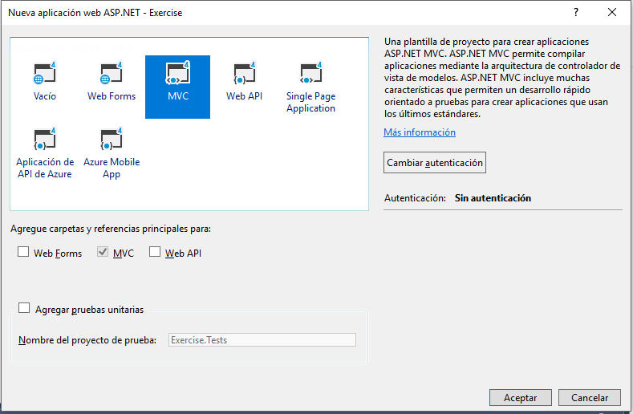
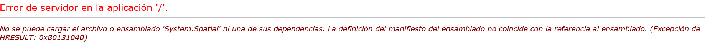

# Extendiendo Office 365 con Microsoft Graph API
En este laboratorio crearemos una aplicación ASP.Net MVC que utilice Microsoft Graph

## Prerequisitos
1. Debes tener un tenant Office 365 para completar este laboratorio. 

## Ejercicio 1: Crear y configurar una aplicacion web MVC

En este ejercicio crearemos una nueva aplicación web MVC para utilizar Microsoft Graph.

1. Abre Visual Studio,
1. En Visual Studio, haz click **Archivo/Nuevo/Proyecto**.
1. En la ventana de **Nuevo proyecto**
  1. Selecciona **Templates/Visual C#/Web**.
  1. Selecciona **Aplicación Web ASP.NET (.NET Framework)**.
  2. Para el nombre del proyecto utiliza **Exercise**,

    
    > **Nota:** Asegúrate de introducir exactamente el mismo nombre para el proyecto Visual Studio que se especifica en estas instrucciones.  El nombre del proyecto  pasa a formar parte del espacio de nombres del código.  El código que se encuentra dentro de estas instrucciones depende del espacio de nombres que coincida con el nombre del proyecto especificado en estas instrucciones.  Si utiliza un nombre de proyecto diferente, el código no se compilará a menos que ajuste todos los espacios de nombres para que coincidan con el nombre del proyecto que introduzca al crear el proyecto.

  1. Haz click en **OK**.
1. En la ventana  **Nuevo Proyecto ASP.NET** 
  1. Haz click en **MVC**.
  2. Haz click en el botón **Cambiar autenticación**.
  3. Selecciona **Cuentas profesionales o educativas**.
  4. Selecciona **Nube - Organización única**
  5. y tu dominio en el campo **Dominio**(por ejemplo, contoso.onmicrosoft.com)
  6. Marca **Leer datos de directorio** bajo permisos de acceso de directorio 
  7. Haz click en  **Aceptar**.
  
    

    

1. Modifica el proyecto web para usar SSL por defecto:
  1. En la ventana de **Explorador de Soluciones**, selecciona el proyecto y ve a la ventana **Propiedades**. 
  1. Cambia la propiedad **SSL habilitado** a **TRUE**.
  1. Copia la propiedad **Dirección URL de SSL** al portapapeles para usar en el siguiente paso.
  1. Guarda tus cambios.

    
    > Es importante hacer esto ahora porque en el siguiente paso cuando creemos la aplicación en Azure AD, queremos que la URL de respuesta utilice HTTPS. Si no lo hacemos ahora, tendremos que hacer manualmente los cambios que el asistente de Visual Studio va a hacer al crear la aplicación.
    
1. configura el proyecto para que vaya a la página de incio cuando hagamos debug:
  1. En el **Explorador de Soluciones**, haz click con el botón derecho en el proyecto y selecciona **Propiedades**.
  1. Selecciona la pestaña **Web** en el margen derecho.
  1. En la sección **Acción de Inicio**.
  1. Selecciona  **Dirección URL de inicio** e introduce la dirección SSL del proyecto que copiamos en el paso anterior.
  
1. En este punto podemos probar la autenticación de la aplicación.
  1. En Visual Studio, presiona **F5**. El navegador se lanzará automaticamente tomando tu página de inicio HTTPS para arrancar la aplicación.

   	> **Note:**
   	> 1. Si al ejecutar la aplicación muestra un error del ensamblado 'System.Spatial', haz click con el botón derecho en el proyecto, selecciona **Administrar paquetes Nuget** y actualiza System.Spatial a la última versión.
   	> 
   	> 

  1. Para logearte, haz click en el botón  **Sign In** en la esquina superior derecha.
  1. Logeate usando tu **Cuenta empresarial o educativa**.
  1. Una vez que te hayas logueado correctament, y si es la primera vez que te logueas, Azure AD te mostrará una ventana para que consientas los permisos utilizados por la aplicación:

    

  1. Haz click en **Aceptar** para aprobar la petición de permisos de la aplicación.
  1. Una vez hagas esto, te redireccionará de nuevo a tu aplicación. Fijate que ahora muestra tu usuario en la esquina superior derecha donde antes aparecía **Sign In**


## Ejercicio 2: configura la aplicación web para usar Azure AD y OWIN

1. Establece los permisos de aplicación necesarios.

  1.Navega a [Azure Management Portal](https://portal.azure.com) y logueate con tu  **Cuenta profesional o educativa**.

  1. En el menú de la izquierda, haz click **Azure Active Directory**.
  1. Selecciona **Registros de aplicaciones**.
  1. Selecciona la aplicacion **Exercise** que se ha creado en los pasos previos.
  1. En **Configuración**, selecciona **Permisos necesarios** y en la barra de menú superior selecciona **Agregar**. Se mostrará una pestaña con el título **Agregar acceso de API**
  1. Selecciona **Seleccionar una API**, de las opciones disponibles elegir **Microsoft Graph** y pulsa el botón **Seleccionar** de la zona inferior
  1. Una vez que hayamos seleccionado **Microsoft Graph API** se nos mostrará los permisos que queremos que tenga la aplicación. En esta pantalla seleccionaremos **Read user calendars** que se encuentra dentro de **Permisos delegados**
  1. Guardamos los cambios haciendo click en el botón **Guardar** de la zona superior

    

    
  
     
1. En el proyecto de Visual Studio, añade una clase helper que será usada para recolectar configuraciones del `web. config` y crear las cadenas necesarias que serán usadas para la autenticación::

  1. Haz click con el botón derecho en el proyecto y selecciona **Agregar/Nueva Carpeta**. Llama a la carpeta **Utils**. 
  1. Localiza la carpeta **Lab Files** en el directorio del laboratorio. Dentro de esa carpeta se encuentra el fichero **SettingsHelper.cs**. Arrastralo a la carpeta **Utils** que hemos creado para añadirlo en el proyecto
      
1. Actualiza el fichero **_Layout** para añadir un link a **Calendario**:
    1. Abre el fichero **_Layout.cshtml**que se encuentra en la carpeta **Views/Shared**.
      1. Localiza la parte del archivo que incluye los links del menú de la página, debe ser similar a lo siguiente:
      
        ````asp
        <div class="navbar-collapse collapse">
            <ul class="nav navbar-nav">
                <li>@Html.ActionLink("Inicio", "Index", "Home")</li>
                <li>@Html.ActionLink("Acerca de", "About", "Home")</li>
                <li>@Html.ActionLink("Contacto", "Contact", "Home")</li>
            </ul>
            @Html.Partial("_LoginPartial")
        </div>
        ````

      1. Modifica la navegación para añadir un nuevo enlace (el enlace **Calendario** añadido debao) y una referencia al control de login que hemos creado:

        ````asp
        <div class="navbar-collapse collapse">
          <ul class="nav navbar-nav">
              <li>@Html.ActionLink("Inicio", "Index", "Home")</li>
              <li>@Html.ActionLink("Acerca de", "About", "Home")</li>
              <li>@Html.ActionLink("Contacto", "Contact", "Home")</li>
              <li>@Html.ActionLink("Calendario", "Index", "Calendar")</li>
          </ul>
          @Html.Partial("_LoginPartial")
      </div>
        ````

        > El link **Calendario** aún no funciona, lo haremos en los próximos pasos.

## Exercise 3: Agregando las llamadas a Microsoft Graph SDK
En estos pasos lo que haremos será añadir el controlador y vistas que utilizarán Microsoft Graph SDK

1. Añade el paquete de NuGet  Microsoft Graph:
  1. Haz click en  **Ver/Otras ventanas/Consola de administración de paquetes**.
  1. En la **Consola de administración de paquetes**, escribe **Install-Package Microsoft.Graph** y presiona **Enter**.
  
     
1. Una vez que hemos realizado el proceso de autenticación, lo que vamos a hacer es añadir un controlador que devolverá eventos del calendario:
  1. Haz click con el botón derecho en la carpeta **Models** y selecciona **Agregar/Clase**.
    1. En la ventana de **Agregar clase**, ponla el nombre **MyEvent** y haz click en **Agregar**.
    1. Añade las siguientes sentencias `using` después de las sentencias `using` existentes en la clase **MyEvent.cs**:

    ````c#
	using System.ComponentModel;
	using System.ComponentModel.DataAnnotations;   
    ````

    1. Implementa la nueva clase **MyEvent** usado el siguiente fragemento de código
    
    ````c#
    public class MyEvent {           
        [DisplayName("Subject")]
        public string Subject { get; set; }

        [DisplayName("Start Time")]
        [DisplayFormat(DataFormatString = "{0:dd/MM/yyyy}", ApplyFormatInEditMode = true)]
        public DateTimeOffset? Start { get; set; }

        [DisplayName("End Time")]
        [DisplayFormat(DataFormatString = "{0:dd/MM/yyyy}", ApplyFormatInEditMode = true)]
        public DateTimeOffset? End { get; set; }
    }
    ````
  1. En el **Explorador de Soluciones**, haz click con el botón derecho en la carpeta **Controllers** y selecciona **Agregar/Controlador**.
    1. En la ventana  **Agregar Scaffold**, selecciona **Controlador de MVC 5 - en blanco** y haz click en **Agregar**.
    1. En la ventana  **Agregar Controlador**, llama al controlador **CalendarController** y haz click en **Agregar**.
  1. Añade las siguientes sentencias `using` después de las sentencias `using` existentes en el fichero **CalendarController.cs**:

    ````c#
	using Exercise.Utils;
	using Microsoft.IdentityModel.Clients.ActiveDirectory;
	using System.Security.Claims;
	using System.Threading.Tasks;
	using Exercise.Models;
	using System.Net.Http.Headers;
	using Microsoft.Graph;    
    ````

  1. Decora el controlador con el atriburo `[Authorize]` para sólo permitir la ejecución a usuarios autenticados:

    ````c#
    namespace Exercise.Controllers {
      [Authorize]
      public class CalendarController : Controller {}
    }
    ````

  1. Crea el método `GetGraphAccessTokenAsync` para obtener el token de acceso a Microsoft Graph API:

    ````c#
    public async Task<string> GetGraphAccessTokenAsync()
    {
        var signInUserId = ClaimsPrincipal.Current.FindFirst(ClaimTypes.NameIdentifier).Value;
        var userObjectId = ClaimsPrincipal.Current.FindFirst(SettingsHelper.ClaimTypeObjectIdentifier).Value;

        var clientCredential = new ClientCredential(SettingsHelper.ClientId, SettingsHelper.ClientSecret);
        var userIdentifier = new UserIdentifier(userObjectId, UserIdentifierType.UniqueId);

        // create auth context
        AuthenticationContext authContext = new AuthenticationContext(SettingsHelper.AzureAdAuthority, new ADALTokenCache(signInUserId));
        var result = await authContext.AcquireTokenSilentAsync(SettingsHelper.AzureAdGraphResourceURL, clientCredential, userIdentifier);

        return result.AccessToken;
    }
    ````

 1. Crea el método `GetGraphServiceClient` para obtener el cliente para las llamadas a Microsoft Graph API:

    ````c#
    public static GraphServiceClient GetGraphServiceClient(string token)
    {
        var authenticationProvider = new DelegateAuthenticationProvider(
            requestMessage =>
            {
                requestMessage.Headers.Authorization = new AuthenticationHeaderValue("Bearer", token);
                return Task.FromResult(0);
            });

        return new GraphServiceClient(SettingsHelper.GraphResourceUrl, authenticationProvider);
    }
    ````

  1. Modifica el método `Index()`  para que se ejecute de forma asíncrona añadiendo  `async` y modificando el tipo que devuelve:

    ````c#
    public async Task<ActionResult> Index() {}
    ````
  1. En el método  `Index()`, usa el cliente `GraphServiceClient` para llamar a Microsoft Graph API y devolver los 20 primeros eventos en el calendario del usuario:

    ````c#
    var eventsResults = new List<MyEvent>();
    var accessToken = await GetGraphAccessTokenAsync();

    try
    {
        var graphService = GetGraphServiceClient(accessToken);
        var request = graphService.Me.Events.Request(new Option[] { new QueryOption("top", "20"), new QueryOption("skip", "0") });
        var userEventsCollectionPage = await request.GetAsync();
        foreach (var evnt in userEventsCollectionPage)
        {
            eventsResults.Add(new MyEvent
            {
                Subject = !string.IsNullOrEmpty(evnt.Subject) ? evnt.Subject : string.Empty,
                Start = !string.IsNullOrEmpty(evnt.Start.DateTime) ? DateTime.Parse(evnt.Start.DateTime) : new DateTime(),
                End = !string.IsNullOrEmpty(evnt.End.DateTime) ? DateTime.Parse(evnt.End.DateTime) : new DateTime()

            });
        }
    }
    catch (Exception el)
    {
        el.ToString();
    }

    ViewBag.Events = eventsResults.OrderBy(c => c.Start);
    ````
  
  La última linea del método `Index()` devolverá la vista por defecto del control, así que dejala igual.
  
1. Guarda los cambios.
1. Modifica la vista para mostrar los resultados.
  1. En la clase `CalendarController`, haz click con el botón derecho en `View()` que se encuentra al final del método `Index()` y selecciona **Agregar vista**.
  1. En la ventana **Agregar vista** define los siguientes valores:
    1. Nombre de vista: **Index**.
    1. Plantilla: **Empty (without model)**.

    > Deja el resto de campos vacios y marca únicamente la opción **Usar página de diseño** aunque lo dejaremos en blanco para que utilice _Viewstart.    
  1. Haz click en **Agregar**.   
  1. En el archivo **Views/Calendar/Index.cshtml**, borra todo el código y reemplazalo por lo siguiente:

    ````html
    @{
      ViewBag.Title = "Home Page";
    }
    <div>
      <table>
        <thead>
          <tr>
            <th>Subject</th>
            <th>Start</th>
            <th>End</th>
          </tr>
        </thead>
        <tbody>
          @foreach (var o365Event in ViewBag.Events) {
            <tr>
              <td>@o365Event.Subject</td>
              <td>@o365Event.Start</td>
              <td>@o365Event.End</td>
            </tr>
          }
        </tbody>
      </table>
    </div>
    ````

  1. Guarda los cambios.
1. Ejecuta la aplicación pulsando  **F5**.

   1. La aplicación te mostrará una ventana para hacer login (si no estás logueado). Si no te muestra el login, haz click en el enlace **Sign in** en la zona superior derecha de la página inicial de la aplicación
  2. Haz login usando tu  **Cuenta corporativa o educativa**.
  3. Si te pregunta, confia en los permisos solictados en la aplicación.
  4. En la página de inicio de la aplicación, haz click en el enlace **Calendario**.
  5. Verifica que se muestran los eventos del calendario.
   

