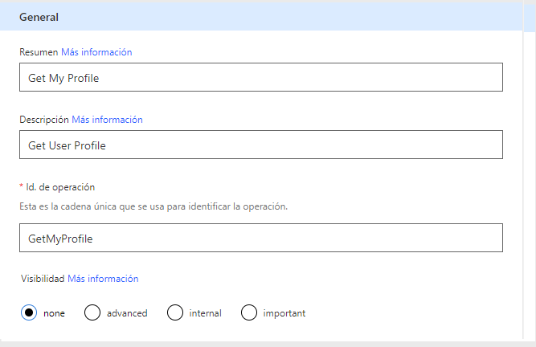
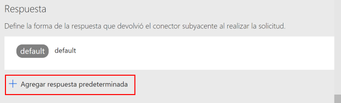

# Como utilizar Graph y no morir en el intento

En este laboratorio crearemos un conector personalizado que haga llamadas a Microsoft Graph API y que luego podamos utilizar en Flow y Power Apps

## Prerequisitos

1. Debes tener un tenant Office 365 para completar este laboratorio. 
1. Visual Studio 2017

## Registrar la aplicación en Azure AD

1. Ir al portal de Azure https://portal.azure.com y loguearte con un usuario con permisos para registrar aplicaciones
1. En el menú accede a Azure Active Directory
1. Pulsar sobre Registro de aplicaciones


1. Pulsar sobre Nuevo registro de aplicaciones


1. Indicar:
- Nombre: Nombre de la aplicación
- Tipo de aplicación: Aplicación web o API
- Url de inicio de sesión: una url con formato válido, no es necesario que sea accesible


1. Pulsa el botón Crear para registrar la aplicación
1. Una vez registrada la aplicación, apunta el Id de aplicación, lo necesitaremos más adelante


1. Una vez registrada la aplicación, debemos darle permisos para acceder a Microsoft Graph, para ello, pulsa en Configuración y accede a Permisos necesarios

 

1. En la pantalla de Permisos necesarios pulsa sobre Agregar

 

1. Pulsa sobre Seleccionar una API y en la siguiente pantalla seleccionamos Microsoft Graph y pulsamos sobre Seleccionar


1. Una vez seleccionado Microsoft Graph debemos especificar que permisos necesitamos, para ello pulsamos sobre Seleccionar permisos y nos mostrará los permisos sobre los que podemos habilitar el acceso


1. Para nuestro ejemplo seleccionaremos "Sign in and read user profile"
1. Una vez hayamos seleccionado los permisos pulsamos sobre Listo para guardar los cambios.
1. Ahora necesitamos generar una clave para acceder al API, para en la pantalla de configuración de la aplicación pulsamos sobre Claves


1. En la sección contraseñas añadimos una descripción para la contraseña y el tiempo de expiración


1. La clave se generará una vez guardemos los cambios. En este momento apunta la clave que se genera porque es el único momento que podrás verla.


## Crear Conector personalizado

1. Accede a Microsoft Flow e inicia sesión 
1. Pulsa sobre el icono   y en el menú selecciona Conectores personalizados, en esta pantalla se mostrará todos los conectores personalizados que hayas creado


1. Pulsa sobre Crear conector personalizado y Crear desde cero

 

1. En la ventana que aparece introduce el titulo del conector y pulsa sobre Continuar

 

1. En la siguiente pantalla podremos cargar el icono que queremos para el conector, color de fondo, etc. En la sección Esquema deberemos seleccionar HTTPS, como host indicaremos graph.microsoft.com y la URL Base ‘/’

 

1. Una vez hayamos introducido los datos del host pulsamos sobre Seguridad para pasar a la siguiente pantalla
1. En la siguiente pantalla nos solicita el Tipo de autenticación, en el desplegable seleccionaremos OAuth 2.0
1. Una vez hayamos seleccionado OAuth 2.0 nos muestra los datos de configuración de la autenticación. Deberemos introducir:
- Proveedor de identidades: Azure Active Directory
- Client id: id de la aplicación que hemos registrado en Azure AD
- Client secret: clave que hemos generado al registrar la aplicación en Azure AD
- Login url: https://login.windows.net
- Tenant ID: common 
- Resource URL: https://graph.microsoft.com
- Ámbito (opcional)


 
1. Pulsamos sobre Crear conector para generar la url de redireccionamiento, que necesitamos para la aplicación que hemos registrado en Azure AD

 

1. Una vez generada la url de redireccionamiento, la copiamos y volvemos al portal de Azure. No cierres esta ventana ya que volveremos para terminar de configurar el conector
1. En la configuración de la aplicación que hemos registrado en Azure AD pulsamos sobre URL de respuesta

 

1. En la pantalla que se muestra añadimos la url que hemos obtenido del conector y pulsamos sobre guardar

 

1. Con esto ya tenemos registrada nuestra aplicación en Azure AD y creado nuestro conector. Lo único que nos queda es añadir las peraciones que necesitamos a nuestro conector.

## Añadir operaciones al conector

1.Dentro de la configuración del conector pulsamos sobre Definición y se muestra la pantalla para poder añadir Acciones y Desencadenadores a nuestro conector

 

1. Pulsamos sobre Nueva acción en el panel de la derecha.
1. En la siguiente pantalla nos solicita un nombre, descripción e identificador para la acción. En nuestro ejemplo obtendremos el perfil del usuario.

 

1. Hacemos scroll hacia abajo y vemos que nos solicita detalles sobre la consulta que tiene que realizar. Pulsaremos sobre Importar desde ejemplo

1. En el panel que se muestra introducir como verbo GET y la url https://graph.microsoft.com/v1.0/me. Podéis probar las consultas en el explorador de Graph https://developer.microsoft.com/en-us/graph/graph-explorer, además es bueno ya que necesitaremos el cuerpo de la respuesta en el siguiente paso. Una vez que hayamos introducido la url de la consulta pulsar sobre Importar

 

1. Ahora debemos añadir agregar el formato de resupuesta. Para ello pulsamos sobre Agregar respuesta prederteminada en la sección Respuesta 

 

1. Se nos muestra una pantalla para introducir el formato de la respuesta, podemos ejecutar la consulta en Graph Explorer y obtener la respuesta, o copiar 

````json

{
    "@odata.context": "https://graph.microsoft.com/v1.0/$metadata#users/$entity",
    "id": "48d31887-5fad-4d73-a9f5-3c356e68a038",
    "businessPhones": [
        "+1 412 555 0109"
    ],
    "displayName": "Megan Bowen",
    "givenName": "Megan",
    "jobTitle": "Auditor",
    "mail": "MeganB@M365x214355.onmicrosoft.com",
    "mobilePhone": null,
    "officeLocation": "12/1110",
    "preferredLanguage": "en-US",
    "surname": "Bowen",
    "userPrincipalName": "MeganB@M365x214355.onmicrosoft.com"
}
````

1. Una vez pulsemos sobre Importar se mostrará todos los elementos de salida  de nuestra consulta y que podremos utilizar en Flow

 

1. Pulsamos sobre Actualizar conector para guardar la acción que hemos creado

 

1. Con esto ya tenemos creada la operación. Sólo nos queda crear un Flow para probar nuestro conector

