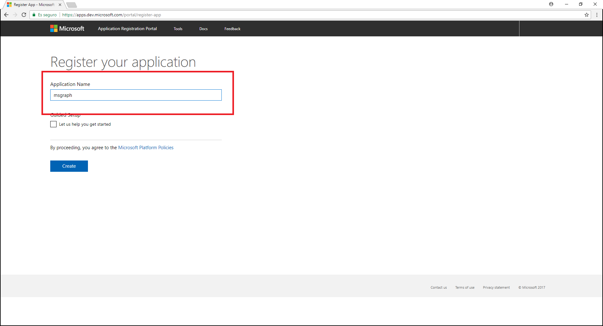
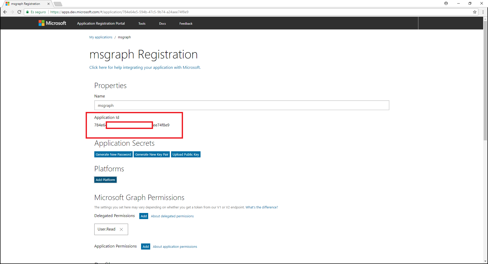
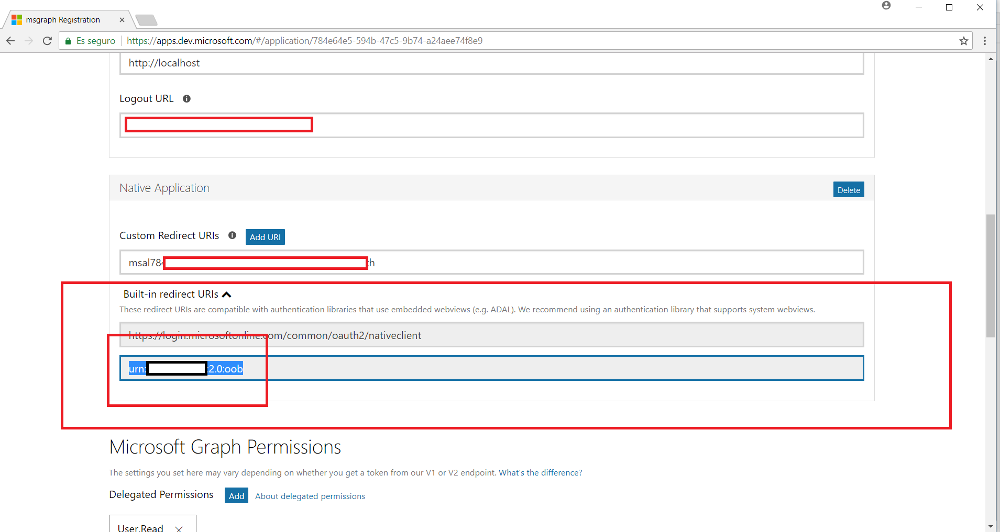

# Getting Started with Quick Start

----------

In order for our applications to use the MS Graph API, we must have an application ID.

We must register the application in the Microsoft Application Registry. 

> Note: You will need either a [school or work](https://developer.microsoft.com/en-us/office/dev-program) or [Microsoft account](https://signup.live.com/signup?wa=wsignin1.0&ct=1473983465&rver=6.6.6556.0&wp=MBI_SSL&wreply=https://outlook.live.com/owa/&id=292841&CBCXT=out&cobrandid=90015&bk=1473983466&uiflavor=web&uaid=3b7bae8746264c1bacf1db2b315745cc&mkt=EN-US&lc=1033&lic=1)

## Setting up app id
### Register the app in App Registration Portal
First, go to [Microsoft App Registration Portal](https://apps.dev.microsoft.com/)

> **Note:** Login with your  [school or work](https://developer.microsoft.com/en-us/office/dev-program) or [Microsoft account](https://signup.live.com/signup?wa=wsignin1.0&ct=1473983465&rver=6.6.6556.0&wp=MBI_SSL&wreply=https://outlook.live.com/owa/&id=292841&CBCXT=out&cobrandid=90015&bk=1473983466&uiflavor=web&uaid=3b7bae8746264c1bacf1db2b315745cc&mkt=EN-US&lc=1033&lic=1)

After login we follow these steps:

 1. Choose Add an app
  
     
	

	> **Note**: If you signed in with a work or school account, select the **Add an app** button for **Converged applications**.

 2. Enter an app name and click **Create**
	
	 

	> **Note**: After creation, the page display a list of properties.	

 3. Copy the Application Id and save it to a document as we will need it later 
	
	 

	> **Note**: We will need the **Application Id** to configure our app.	

 4. Now, we click on Add Platform and select Native Application 	
	
	 

	> **Note**: In our case we select **Native Application** because we will use an **UWP app**

 5. The Built-in redirect URI value has been created automatically. Save this value to the same document as the Application Id for future reference. 
	
	 
 
 6. Finally, we click on Save. 

## Choosing the project template

Now we will download the UWP application. We will use it and configure it with the Application Id and the Redirect Uri that we saved before.

#### Download UWP project from Github 

Download project from [here](../src) 

#### Build and Debug

Now we configure the app with the Application Id and Redirect URI.
Open the App.xaml file and add this code:

	<Application.Resources>
        <x:String x:Key="ida:ClientID">ENTERYOURCLIENTID</x:String>
        <x:String x:Key="ida:ReturnUrl">ENTERYOURREDIRECTURI</x:String>
    </Application.Resources>

> Change **ENTERYOURCLIENTID** for your Application Id and **ENTERYOURREDIRECTURI** for the Redirect Uri we saved before

 
To Build and run the applications follow this steps.

1. Now select x86 as build target.
2. Select Local Machine.
3. Build the application.
4. Run the application.

If everything is properly configured you will see:

 

# Adding API calls to your project

Now we will add user authentication.

## Add user authentication with MS Graph
Open UWP code in Visual Studio and follow these steps.

- Go to Helpers/AuthenticationHelper.cs
- In GetAuthenticatedClient() Method
- Delete this code:

   	`throw new NotImplementedException();`

- Add the following code:

		if (graphClient == null)
            {
                // Create MS Graph client.
                try
                {
                    graphClient = new GraphServiceClient(
                        "https://graph.microsoft.com/v1.0",
                        new DelegateAuthenticationProvider(
                            async (requestMessage) =>
                            {
                                var token = await GetTokenForUserAsync();
                                requestMessage.Headers.Authorization = new AuthenticationHeaderValue("bearer", token);
                            }));
                    return graphClient;
                }

                catch (Exception ex)
                {
                    Debug.WriteLine("Could not create a graph client: " + ex.Message);
                }
			}
			return graphClient;

As you can see it is exactly the same code that we used in the console application, and this is because for the UWP application we have used the same NuGet package.

> **Note:** In previous steps we configured the **ClientID** and **ReturnURL** field in the App.xaml file. Check that you have added them correctly.

Now run the application and click the **Log in** menu button to authenticate.
